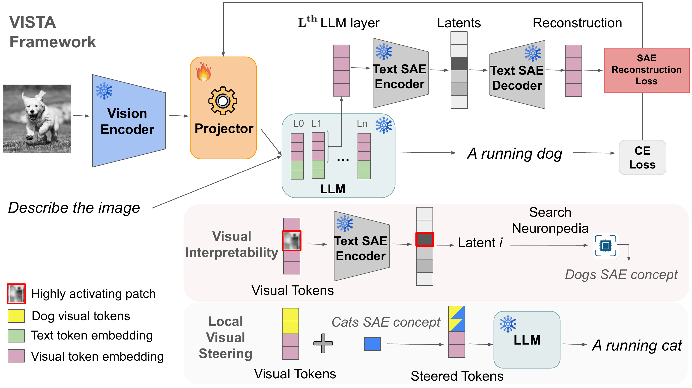

<div align="center">
  <h1>Interpretability Transfer from Language to Vision via Sparse Autoencoders</h1>
</div>

<div align="center">
Alexey Kravets<sup>1</sup>,
Da Li<sup>2</sup>,
Chuan Li<sup>3</sup>,
Da Chen<sup>1</sup>,
Vinay P. Namboodiri<sup>1</sup><br>
<sup>1</sup>University of Bath, UK &nbsp;&nbsp;
<sup>2</sup>Samsung AI Centre Cambridge &nbsp;&nbsp;
<sup>3</sup>Lambda, Inc.
</div>

<br></br>

<div align="center">
    
</div>

This repository contains the reference code for the paper *Interpretability Transfer from Language to Vision via Sparse Autoencoders.*

[🎯 Project web page](https://akres001.github.io/Interpretability-Transfer-from-Language-to-Vision-via-Sparse-Autoencoders/)

## Table of Contents

1. [Citation](#citation)
2. [Overview](#overview)
3. [Setup](#setup)
4. [Layout](#layout)
5. [Datasets](#datasets)
6. [Checkpoints](#checkpoints)
7. [Usage](#usage)
8. [Outputs](#outputs)
9. [Acknowledgments](#acknowledgments)


## Citation <a name="citation"></a>

```bibtex
@InProceedings{kravets2026vista,
  author    = {Kravets, Alexey and Li, Da and Li, Chuan and Chen, Da and Namboodiri, Vinay P.},
  title     = {{Interpretability Transfer from Language to Vision via Sparse Autoencoders}},
  booktitle = {Proceedings of the International Conference on Machine Learning (ICML)},
  year      = {2026}
}

```

## Overview <a name="overview"></a>

Recent advances in language model interpretability using sparse autoencoders (SAEs) have yet to effectively translate to the visual domain, mainly due to the difficulty and ambiguity of labeling visual concepts. In this paper, we introduce Visual Interpretability via SAE Transfer Alignment (VISTA), a framework that transfers interpretability from language to vision in a LLaVA-style vision-language model by constraining a visual projector to map visual tokens into an LLM's pre-existing, labeled textual SAE space. This approach enables visual interpretability without training dedicated vision SAEs. By regularizing the projector using the LLM's SAE reconstruction loss, VISTA achieves a threefold increase in the matching rate, which measures how accurately the most activating textual concepts in the SAE space correspond to semantic elements in the image. Using this framework, we further analyze spatial localization properties of different vision encoders and show that DINOv2 features have stronger localization abilities than other encoders. Leveraging this precision, we validate VISTA's cross-modal alignment through fine-grained, localized concept interventions, where specific objects are removed or replaced in the model's perception while preserving the surrounding scene. This results in improvements of 35\% in object removal and 47\% in object replacement tasks over vision-only baselines, providing causal evidence that visual tokens inhabit the text SAE manifold. These contributions are validated across multiple LLM architectures.

## Setup <a name="setup"></a>

```bash
pip install -r requirements.txt
```

Open each `.sh` script and set the values at the top — tokens (HF, Neuronpedia), `PROJECTOR` path, model/vision choice, and sample counts.

## Layout <a name="layout"></a>

```
├── analysis/
│   ├── scripts/
│   │   ├── cache_activations.py
│   │   ├── localization.py
│   │   ├── matching_rate.py
│   │   ├── reconstruction_sparsity.py
│   │   └── steering.py
│   ├── vlm_sae/
│   │   ├── __init__.py
│   │   ├── api.py
│   │   ├── config.py
│   │   ├── data.py
│   │   ├── llava_dataset.py
│   │   ├── models.py
│   │   └── vision.py
│   ├── use_images_location.txt
│   └── steering_imgs.py
├── data/
├── results/
├── train/
│   ├── train.py
│   ├── train.sh
│   └── weights/
├── matching.sh
├── steering.sh
└── localization.sh
```

## Datasets <a name="datasets"></a>

Follow the instructions [here](https://github.com/cvenhoff/vlm-mapping/blob/main/install_data.sh) to install the training data.

## Checkpoints <a name="checkpoints"></a>

DINOv2 projectors for Gemma-2B, Gemma-9B and LLaMA 3.1 are in:

```bash
./train/weights
```

## Usage <a name="usage"></a>

```bash
cd train && ./train.sh   # train the projector
./matching.sh            # matching rate + reconstruction/sparsity
./steering.sh            # SAE-direction steering on visual tokens
./localization.sh        # bounding-box localization accuracy
```

## Outputs <a name="outputs"></a>

| Script             | Writes                                                                       |
| ------------------ | ---------------------------------------------------------------------------- |
| `train/train.sh`   | `train/weights/projector_*.pth`                                              |
| `matching.sh`      | `results/matching_rate.{json,pdf}`, `results/reconstruction_sparsity.pdf`    |
| `steering.sh`      | `results/steering_<model>_<vision>.json`                                     |
| `localization.sh`  | `results/localization_results.json`                                          |

## Acknowledgments <a name="acknowledgments"></a>

Parts of this codebase were adapted from [cvenhoff/vlm-mapping](https://github.com/cvenhoff/vlm-mapping). We thank the authors for releasing their code.